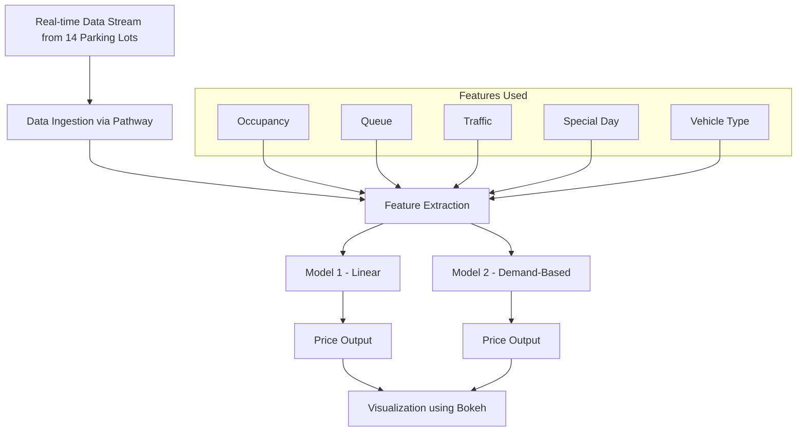

# SA-Capstone-Project
# Dynamic Pricing for Urban Parking Lots

This is the Capstone Project for **Summer Analytics 2025** by CnA × Pathway.  
It simulates a smart pricing engine for urban parking lots using **real-time data**.

---

## Project Overview

In cities, parking spaces are limited and demand keeps changing during the day.  
If prices stay fixed, it leads to too much crowd or empty lots.

This project solves this using **dynamic pricing** — where the price changes in real time, depending on:

- Current occupancy
- Traffic around the area
- Queue length
- Vehicle type
- Special days/events
- Nearby competitor prices

Our system uses **real-time data** and calculates smart, smooth pricing for each parking lot.

---

## Tech Stack Used

| Tool           | Use                                     |
|----------------|------------------------------------------|
| Python         | Main programming language               |
| Pandas, NumPy  | Data processing and math operations     |
| Pathway        | Real-time streaming and data windows    |
| Bokeh          | Real-time price visualizations          |
| Jupyter Notebook | Development and reporting environment |

---

## Architecture Diagram



## Workflow & Model Logic

### 1. Real-time Data Input

- Data comes from **14 parking lots**.
- It includes: **occupancy, queue length, traffic level, vehicle type**, etc.
- Streamed every **30 minutes** using **Pathway**.

---

### 2. Feature Engineering

We extract the following key features from each data record:

- **Occupancy / Capacity ratio**
- **Queue length**
- **Traffic level** 
- **Vehicle type weight** 
- **IsSpecialDay** 

---

### 3. Models Built

####  Model 1: Baseline Linear Model
```python
Price(t+1) = Price(t) + α × (Occupancy(t+1) - (Occupancy(t)) / (Occupancy(max) - (Occupancy(min))
```

####  Model 2: Demand-Based Pricing
```python
Demand = 1.5 × (Occupancy / Capacity)^2 + 1 × Queue - 0.5 × (Traffic)^0.5 + 0.4 × IsSpecialDay + 0.6 × VehicleTypeWeight

Price(t) = BasePrice × (1 + λ × NormalizedDemand)
```

### 4. Real-time Output

- As new data comes in, prices are recalculated in real-time.
- Pathway triggers this pipeline automatically.
-Final prices are sent to Bokeh for live visual tracking.
